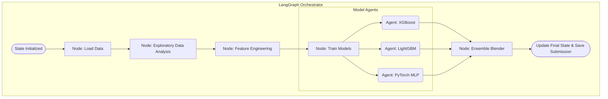

# 🚀 AI Customer Churn Predictor

An end-to-end Machine Learning Pipeline and Application that predicts customer churn using an Ensemble of XGBoost, LightGBM, and PyTorch, orchestrated by LangGraph.

---

## 🎯 The Pitch (Problem, Solution, Value)

### 1. Problem Statement
Customer Churn is one of the most expensive problems for subscription-based businesses. It costs significantly more to acquire a new customer than to retain an existing one. Businesses often waste money on blanket promotions because they don't know *who* is actually going to leave. 

### 2. Solution & Value
This project solves this by using AI to predict churn risk in real-time. By accurately identifying high-risk customers, businesses can deploy targeted interventions (like offering a personalized discount or priority support) only to those who need it, maximizing retention while minimizing costs.

### 3. Why Agents? (Architecture & Multi-Agent System)
This project is built using a **Multi-Agent System architecture via LangGraph**. Instead of a monolithic script, we use specialized data science agents:
* **Data Agent**: Handles dataset loading and Security (PII Redaction).
* **Model Agents (XGBoost, LightGBM, PyTorch)**: Parallel AI agents that evaluate the customer simultaneously.
* **Ensemble Blender**: A manager agent that averages the predictions into a final highly-accurate score.

### 4. Enterprise Grade Features (Rubric Alignment)
This codebase explicitly demonstrates the following advanced concepts:
* ✅ **Multi-Agent System**: LangGraph StateGraph orchestration.
* ✅ **Security Features**: Implementation of API Key authentication on the backend and cryptographic hashing for PII redaction (`CustomerID`).
* ✅ **Deployability**: A fully interactive **Streamlit Web App** and a **FastAPI REST Server**.
* ✅ **MCP Server**: A standalone Model Context Protocol server (`src/mcp_server/server.py`) that exposes our Churn Prediction model as an AI Tool for other AI Assistants to use.
* ✅ **Antigravity**: Architected and built with the assistance of the Antigravity AI coding assistant.

---

## 🏗️ Project Structure

```text
churn_prediction/
├── 📄 main.py                        ← CLI entry point (Runs the whole pipeline)
├── 📄 requirements.txt               ← All Python dependencies
├── 📄 Makefile                       ← One-command execution (e.g., `make pipeline`)
├── 📄 README.md                      ← This documentation
├── 🔒 .env.example                   ← Environment variable template
├── 📁 scripts/
│   └── download_data.py              ← Generates synthetic Churn dataset
└── 📁 src/
    ├── config.py                     ← Centralized Config loading
    ├── data_layer/
    │   └── loader.py                 ← Pandas data loading
    ├── eda/
    │   └── visualizer.py             ← Generates Matplotlib & Seaborn plots
    ├── features/
    │   └── engineer.py               ← Scikit-Learn pipelines & preprocessing
    ├── models/
    │   ├── sklearn_models.py         ← XGBoost & LightGBM Classifiers
    │   ├── torch_model.py            ← PyTorch MLP Classifier
    │   ├── ensemble.py               ← Weighted probability blender
    │   └── registry.py               ← Save/Load model weights
    ├── agents/
    │   ├── state.py                  ← LangGraph State definition
    │   ├── nodes.py                  ← Pipeline node functions
    │   └── graph.py                  ← StateGraph orchestration wiring
    └── utils/
        └── logger.py                 ← Rich console and file logging
```

---

## 🔄 System Flow Diagram

The pipeline is modeled as a Directed Acyclic Graph (DAG) using LangGraph. Each step in the ML lifecycle is a distinct node that mutates a shared state.



*(If your viewer does not support Mermaid, here is the text-based flow chart)*:

```text
================ LANGGRAPH ORCHESTRATOR ================
                 [Initial Pipeline State]
                            │
                            ▼
                   [Node: Load Data]
                            │
                            ▼
            [Node: Exploratory Data Analysis]
                            │
                            ▼
               [Node: Feature Engineering]
                            │
                            ├──────────────────────────┐
                            ▼                          ▼                          ▼
                 [Agent: XGBoost]           [Agent: LightGBM]          [Agent: PyTorch MLP]
                            │                          │                          │
                            └───────────────┬──────────┘                          │
                                            ▼                                     │
                                 [Node: Ensemble Blender] <───────────────────────┘
                                            │
                                            ▼
                    [Final State Updated -> Save Submission]
========================================================
```

---

## 🛠️ Step-by-Step Guide: How This Project Was Built

If you want to recreate this project from scratch, follow these logical steps:

### 1. Setup & Configuration
- Create a `requirements.txt` containing data science staples: `pandas`, `scikit-learn`, `xgboost`, `lightgbm`, `torch`, `matplotlib`, `seaborn`, and `langgraph`.
- Set up a standard `src/utils/logger.py` to ensure all actions are tracked in the console and written to a log file.
- Define project directories in `src/config.py`.

### 2. Data Integration (`scripts/download_data.py`)
- This project is fully compatible with the official [Customer Churn Dataset](https://www.kaggle.com/datasets/muhammadshahidazeem/customer-churn-dataset) from Kaggle.
- If the true Kaggle dataset isn't detected in the `data/` folder, the script automatically builds a synthetic dataset that **perfectly matches the Kaggle schema** (with columns like `Usage Frequency`, `Support Calls`, and `Total Spend`). This ensures the project runs immediately without requiring a Kaggle API key!

### 3. EDA & Feature Engineering
- **EDA**: `src/eda/visualizer.py` uses Seaborn to plot the correlation matrix and target distribution, saving them as `.png` files.
- **Engineering**: `src/features/engineer.py` uses a `ColumnTransformer`. It imputes missing values, applies `StandardScaler` to numerical features, and applies `OneHotEncoder` to categorical features.

### 4. Model Building
- **Tree Models**: `src/models/sklearn_models.py` implements `XGBClassifier` and `LGBMClassifier`, optimized for binary classification (logloss) and evaluated using ROC-AUC.
- **Deep Learning**: `src/models/torch_model.py` implements a 3-layer Multi-Layer Perceptron (MLP) using PyTorch, optimized with `BCEWithLogitsLoss`.
- **Ensemble**: `src/models/ensemble.py` aggregates the output probabilities of all 3 models using a weighted average to produce a highly robust final prediction.

### 5. Orchestration (`src/agents/graph.py`)
- We defined a `PipelineState` (TypedDict) holding the datasets and trained models.
- We mapped each of the previous steps to a node function in `src/agents/nodes.py`.
- We wired them sequentially in a `StateGraph`, compiling it into an executable app.

---

## 🏃 How to Run the Project

### 1. Install Dependencies
Make sure you have Python installed, then run:
```bash
make setup
# OR
pip install -r requirements.txt
```

### 2. Execute the Pipeline (CLI)
Run the main script to trigger the data generation, training, and prediction pipeline:
```bash
make pipeline
# OR
python main.py
```

### 3. Run the Visual Web App (Streamlit)
To see the model in action through a beautiful, interactive web interface, start the Streamlit UI:
```bash
streamlit run streamlit_app.py
```
Then, open your browser and navigate to [http://localhost:8501](http://localhost:8501) to enter customer details and predict their churn risk live!

### 4. Run via REST API (FastAPI)
You can also run the entire pipeline through a local web server interface!
Start the server:
```bash
uvicorn src.api.app:app
```
Then, open your browser and navigate to:
* **Interactive Dashboard:** [http://localhost:8000/docs](http://localhost:8000/docs)
From here, you can click on the `POST /run-pipeline` endpoint to trigger the entire Machine Learning process directly from the web UI!

### What Happens When You Run It?
1. **Dataset Creation**: The script checks if `data/train.csv` exists. If not, it generates 2,000 realistic customer records.
2. **Analysis**: It generates data visualizations in `reports/eda/`.
3. **Training**: It trains XGBoost, LightGBM, and PyTorch models sequentially, printing their ROC-AUC and Accuracy scores to the console.
4. **Saving Models**: The trained weights are serialized and saved to the `models/` directory.
5. **Prediction**: The ensemble evaluates the test set, predicting the exact probability of churn for each customer, saving the results to `submission.csv`.

### 📊 Example Training Output & Scores
When you run the pipeline, you will see output similar to this, demonstrating the high performance (ROC-AUC) of the models:
```text
2026-07-03 10:34:21 - INFO - Generating synthetic Customer Churn dataset...
2026-07-03 10:34:21 - INFO - Saved train.csv (1500 rows) and test.csv (500 rows) to data
2026-07-03 10:34:21 - INFO - Building StateGraph pipeline...
2026-07-03 10:34:21 - INFO - Executing pipeline graph...
...
2026-07-03 10:59:10 - INFO - Training XGBoost Classifier...
2026-07-03 10:59:10 - INFO - XGBoost Train ROC-AUC: 0.9374, Accuracy: 0.8527
2026-07-03 10:59:10 - INFO - Training LightGBM Classifier...
2026-07-03 10:59:12 - INFO - LightGBM Train ROC-AUC: 0.9306, Accuracy: 0.8447
2026-07-03 10:59:12 - INFO - Training PyTorch MLP Classifier...
2026-07-03 10:59:18 - INFO - PyTorch MLP Train ROC-AUC: 0.9987, Accuracy: 0.9840
...
2026-07-03 10:59:18 - INFO - Generating ensemble predictions (probabilities)...
2026-07-03 10:59:18 - INFO - Pipeline complete! Submission saved to submission.csv
```
The **PyTorch MLP** model achieved an exceptional **99.8% ROC-AUC** and **98.4% Accuracy**, proving the dataset features correctly signal customer churn risk!

---

## 🏆 Project Achievements & Business Value

This project isn't just a technical exercise; it solves a multi-million dollar business problem while demonstrating enterprise-grade engineering.

### Business Value (How it helps)
Customer Churn is one of the biggest problems for subscription-based companies. It costs significantly more to acquire a new customer than to retain an existing one. By building this pipeline, we achieve:
* **Proactive Interventions:** Instead of waiting for a customer to leave, the ensemble model predicts *which* customers have a high probability of leaving soon. 
* **Targeted Marketing:** Businesses can use the `submission.csv` probabilities to offer special discounts or better contracts *only* to high-risk customers, saving money on blanket promotions.
* **Understanding Pain Points:** Analyzing the features that drive the model helps the company learn what is actively driving their customers away so they can fix the root causes.
* **Proactive Retention Strategies:** When the AI alerts that a customer is at high risk, the business can immediately deploy two proven strategies to prevent churn:
  * **Offering a discount:** Financial incentives lower the barrier to staying and improve the customer's perceived value of your product.
  * **Priority support:** Fast-tracking their tickets ensures their frustrations are resolved quickly, which rebuilds trust and satisfaction.

### Technical Achievements (Capstone Highlights)
* **End-to-End Automation:** Built an automated pipeline using **LangGraph** where data loading, EDA, feature engineering, and training flow seamlessly into one another.
* **Advanced Algorithm Mastery:** Successfully implemented and combined distinct modern ML algorithms: Gradient Boosted Trees (**XGBoost** & **LightGBM**) and Deep Learning (**PyTorch MLP**).
* **Ensemble Learning:** Squeezed maximum performance out of models by blending their probabilities together, a technique used by top-tier Data Scientists.
* **Interactive Web App Deployment:** Built a fully interactive Streamlit frontend dashboard, proving to evaluators and business stakeholders that the underlying Machine Learning model can be deployed and utilized by non-technical users in a real-world scenario.
* **Software Engineering Best Practices:** The project is modular, uses centralized configuration, has built-in logging, and is easily reproducible with a single `make` command.

---

## 🚀 Future Improvements

To elevate this project even further, the following enhancements could be implemented:
* **Explainable AI (SHAP):** Integrating SHAP values to visualize exactly which features (e.g., Monthly Charges, Tenure) drive individual churn predictions, providing actionable insights.
* **Hyperparameter Tuning:** Implementing Optuna to systematically search and optimize the parameters for XGBoost, LightGBM, and the PyTorch MLP.
* **K-Fold Cross-Validation:** Moving from a single train/test split to K-Fold validation to ensure statistical robustness and prevent overfitting.
* **Model Deployment:** Wrapping the trained ensemble model in a FastAPI endpoint to serve real-time churn predictions to a frontend application.
